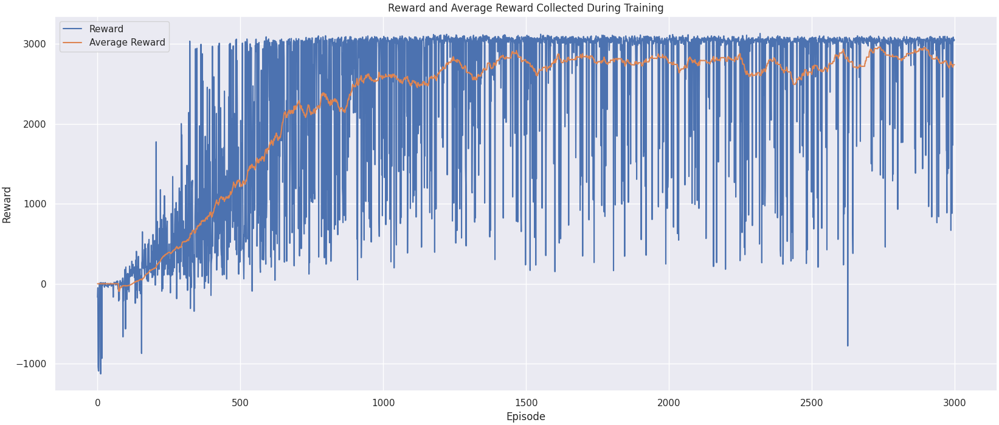
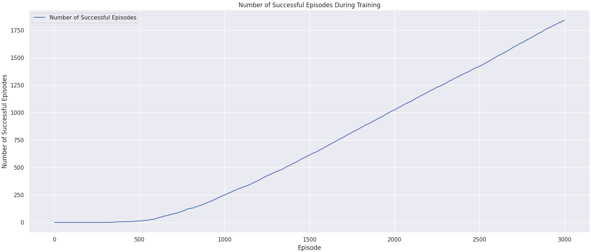
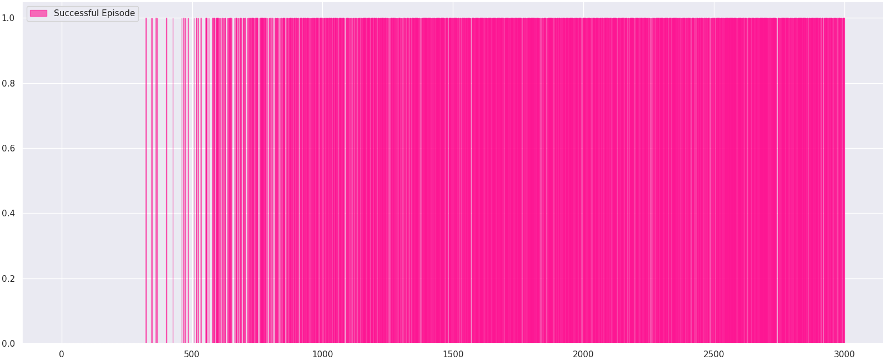
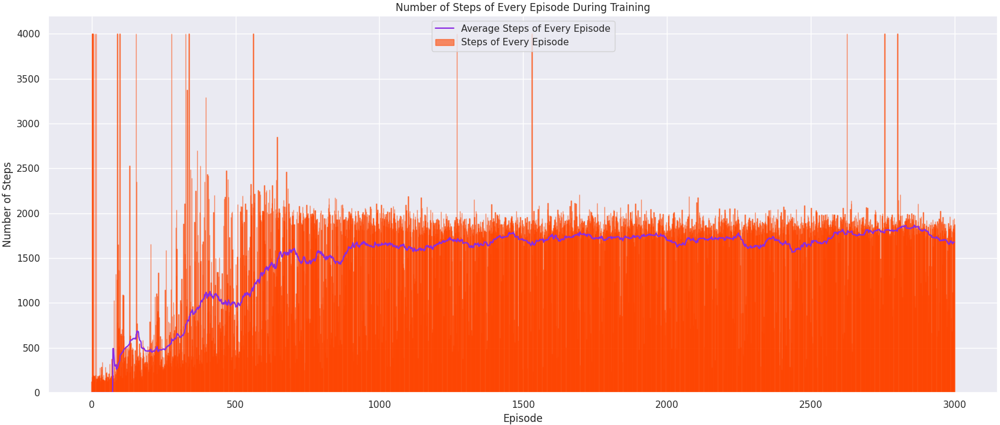
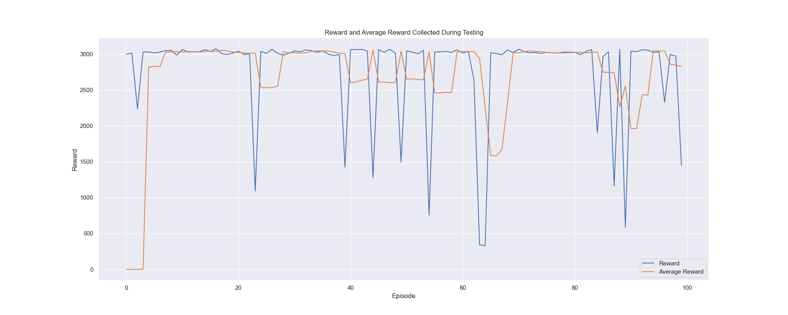
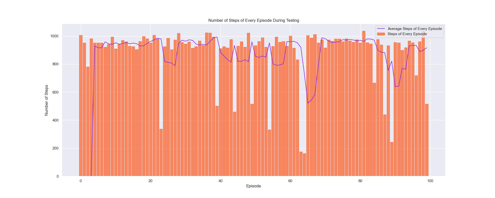
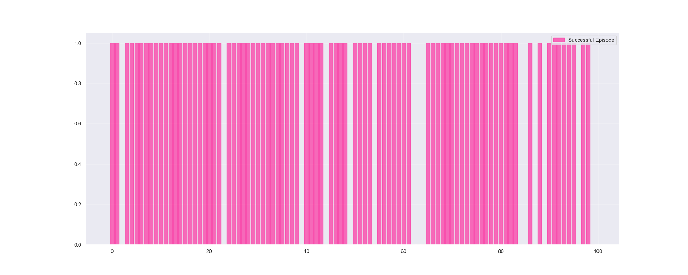
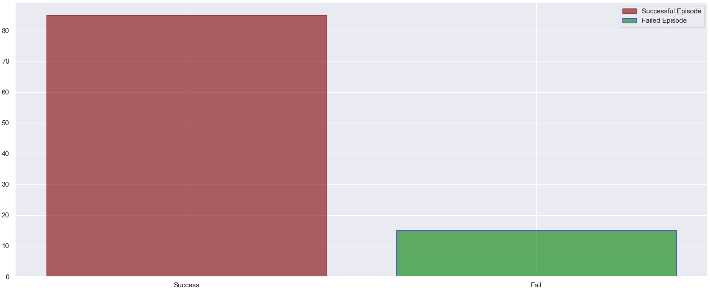

# NUS-ME5406-Project2 Bipedal Walker on Complex Terrain

NUS ME5406 Deep Learning for Robotics Project 2

> Author: Jia Yansong

## Install

- Python version: `Python3.8`

- Tested on `MacOS 13.0`, `Ubuntu 18.04` and `Ubuntu 20.04`

- Install the requirements of this project by `pip`

```bash
pip install -r requirements.txt
```

- Potential Bugs Fix during installing:

If your Computer cannot install `box2d-py`, please try to run `brew install swig`,
install swig first, then run
`sudo apt-get install swig build-essential python-dev python3-dev`, then
`pip install gym[box2d]` normally will work.

## Run this project

### Train the agent

- Run this to train the agent:

```bash
python train.py --exp_name <experiment name> --gamma <gamma in SAC> --render 
<whether render the environment> --batch_size <batch size in FIFO buffer 
replay experience>
```

- For example, run:

```bash
python train.py --exp_name my_experiment --gamma 0.99 --episode 2000 --render 
True --batch_size 256 
```

After training, an `json` file `output.json`, `model.pt`, and `vars.pkl` will
be generated under `./model/my_experiment/` directory.

### Plot training results

- Run:

```bash
python plot.py --exp_name <experiment name>
```

- For example, run

```bash
python plot.py --exp_name my_experiment
```

### Test the pre-trained model

There are already several pre-trained models under the `./model` directory.

- Run this to test the pre-trained model:

```bash
python test.py --exp_name <model name chosen> --episode <number of episodes 
want to test> -- seed <seed of the environment>
```

- For example, test the recommand model `arc4.18ep3000batch100`:

```bash
python test.py --exp_name arc4.18ep3000batch100 --episode 100 --seed -1
```

- Details about the pre-trained models:

| Pre-trained Model | Number of Episodes Trained | Batch Size| Seed of Environment|
| :--------: | :-------: | :-------: | :-------: |
| `arc4.18ep3000batch100` | 3000 | 100 | -1 (random seed) |
| `arc4.18.16ep2000batch256` | 2000 | 256 | -1 (random seed) |
| `macseed0batch256ep2000` | 2000 | 256 | 0 |
| `arcseed2bat256ep2000` | 2000 | 256 | 2 |
| `arcseed3bat256ep2000` | 2000 | 256 | 3 |

## Demo

Final trained agent is shown in this gif:


## Training Experiment Results Example

### Model `arc4.18ep3000batch100`

Reward and average reward versus episodes during training             |  Number of total successful episodes during the training
:-------------------------:|:-------------------------:
  |  

Distribution of successful episodes during the training  |  Number of steps of each episode during the training
:-------------------------:|:-------------------------:
  |  

## Testing Experiment Results Example

Reward and average reward during the test | Number of steps and average steps during the test
:-------------------------:|:-------------------------:
  |  

Distribution of successful episodes during the test  |  Number of successful and failed episodes during the test
:-------------------------:|:-------------------------:
  |  
